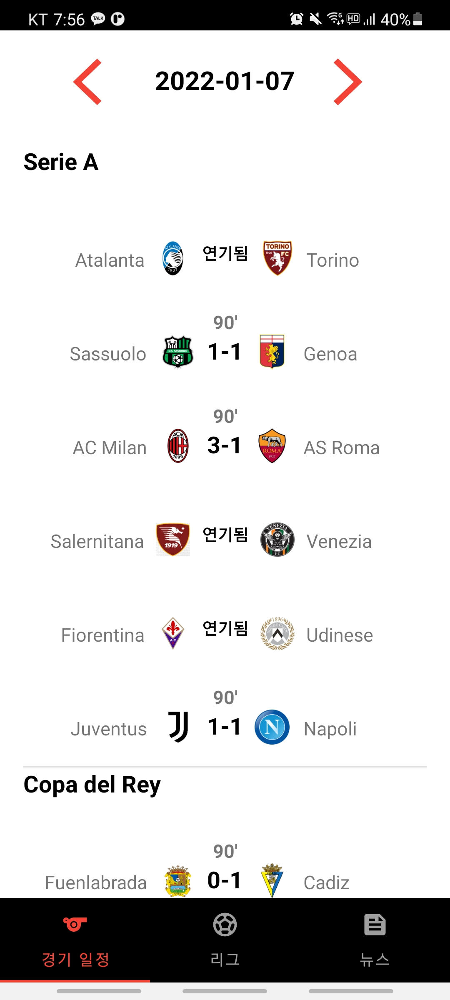
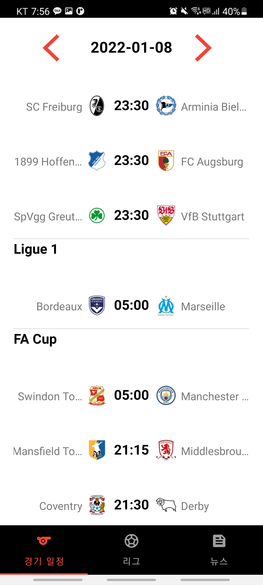
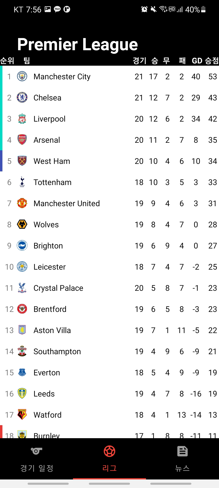
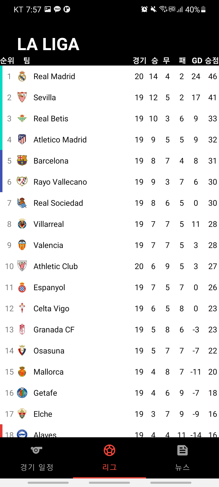
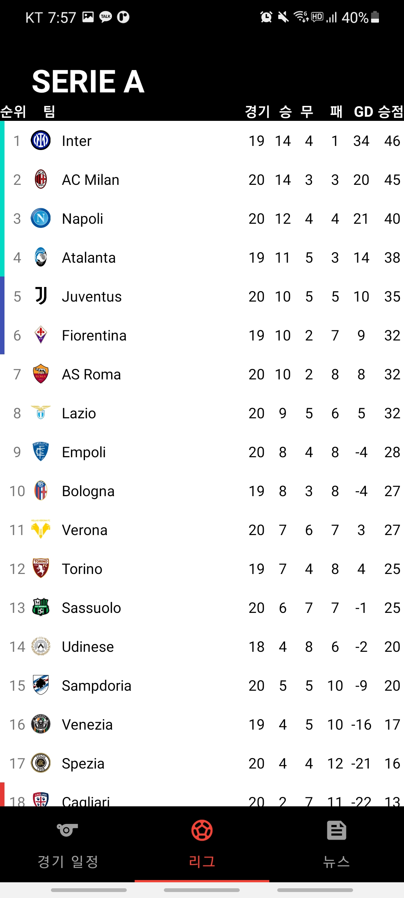

  
# Feetball Football
## USED API
- [API-Sports](https://api-sports.io/documentation/football/v3)

## Screentshots
### 경기 일정
 

### 리그 순위
   

### 뉴스 소식

ㅜㅜ

## 소개
축구에 관심이 많아 제작하게 되었습니다.

지원하는 리그는 하단에 표기되어있습니다.

FixtureFragment에서 출력할 구성하는게 제일 골치아팠는데, API 자체가 전세계 리그 및 컵 경기의 전체 데이터를 받아오거나 특정 리그의 정보만 받아올 수 있도록 되어있습니다. 

그렇기 때문에 하단의 주요 인기 리그 및 컵 경기를 가져오도록 구성하는데에 꽤 시간을 많이 소비했습니다. 

하루에 한정된 요청 횟수 제한이 있었기 때문에 꽤 짜릿했습니다. 허허.

## Leagues & Cups
    EPL (England)           FA CUP (England)            UEFA Champions League
    LA LIGA (Spain)         League Cup (England)        UEFA Europa League
    SERIE A (Italy)         Community Shield (England)  UEFA Super Cup
    BUNDESLIGA (Germany)    Copa del Rey (Spain)        UEFA Europa Conference league
    LIGUE 1 (France)        DFB Pokal (Germany)
                            Coppa Italia (Italy)
                            Couppe de France (France)

## Libraries
- [Retrofit2](https://square.github.io/retrofit/)
- [OkHttp](https://square.github.io/okhttp/)
- [ViewModel](https://developer.android.com/topic/libraries/architecture/viewmodel?hl=ko)
- [GSON](https://github.com/google/gson)
- [LifeCycle-Extensions](https://developer.android.com/jetpack/androidx/releases/lifecycle?hl=ko)
- [ViewPager2](https://developer.android.com/jetpack/androidx/releases/viewpager2?hl=ko)
- [Coroutine](https://developer.android.com/kotlin/coroutines?hl=ko)
- [ThreeTenbp](https://www.threeten.org/threetenbp/)
- [Picasso](https://square.github.io/picasso/)
- [Material UI](https://material.io/)

## RoadMap
- 경기 일정

    ~~- 이전 및 다음 경기 일정 출력~~
- 경기의 상세 결과 출력

    ~~- 슈팅 통계~~

    ~~- 라인업~~

    ~~- 평점~~
- 리그 순위

    - 득점 및 어시스트, 이를 종합한 공격포인트 순위

- 뉴스 수신

    - 언론사 선정 작업중...
- 디자인 개선
    - 다크모드까지 적용 예정

[상세 로드맵](https://github.com/NamJa/Feetball_Football/projects/2)
